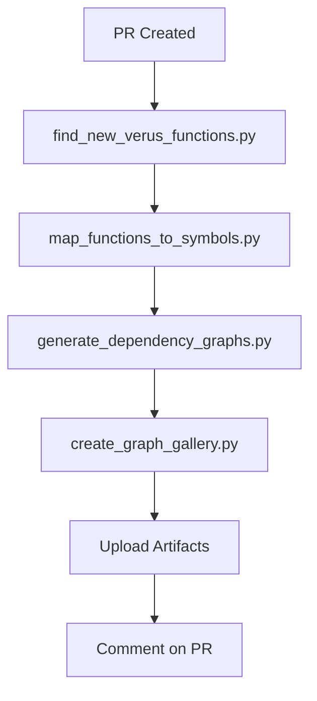

# Verus Function Graph Generation Scripts

This directory contains Python scripts that support the automated generation of call graphs for Verus-verified functions.

## Scripts Overview

### 🔍 `find_new_verus_functions.py`
**Purpose**: Detects newly added Verus functions from git diffs

**Usage**:
```bash
./find_new_verus_functions.py [base_ref]
```

**Features**:
- Analyzes git diff output to find newly added Verus functions
- Filters out Verus-specific function types (`spec`, `proof`, etc.)
- Only returns regular `fn` declarations within `verus!{}` blocks
- Supports different base references (default: `origin/main`)

**Example**:
```bash
# Find new functions compared to main branch
./find_new_verus_functions.py origin/main

# Find new functions compared to a specific commit
./find_new_verus_functions.py abc123
```

### 🗺️ `map_functions_to_symbols.py`
**Purpose**: Maps function names to their SCIP symbols for graph generation

**Usage**:
```bash
./map_functions_to_symbols.py <scip_file> <functions_file> [options]
```

**Arguments**:
- `scip_file`: Path to SCIP JSON file with symbol information
- `functions_file`: File containing function names (one per line)

**Options**:
- `--output`, `-o`: Output file (default: stdout)
- `--format`: Output format (`pipe` or `json`, default: `pipe`)

**Features**:
- Multiple search strategies for robust symbol matching
- Prioritizes symbols with implementation context
- Handles different naming conventions and casing
- Detailed logging for debugging

**Example**:
```bash
# Map functions to symbols
./map_functions_to_symbols.py scip_data.json functions.txt -o mapping.txt

# Output as JSON
./map_functions_to_symbols.py scip_data.json functions.txt --format json -o mapping.json
```

### 📊 `generate_dependency_graphs.py`
**Purpose**: Generates call graphs using the rust-analyzer-test tool

**Usage**:
```bash
./generate_dependency_graphs.py <graph_tool> <scip_file> <mapping_file> <output_dir> [options]
```

**Arguments**:
- `graph_tool`: Path to `generate_function_subgraph_dot` binary
- `scip_file`: Path to SCIP JSON file
- `mapping_file`: File with function|symbol mappings
- `output_dir`: Output directory for graphs

**Options**:
- `--depth`: Graph depth (default: 5)
- `--summary`: Output file for summary report
- `--successful-list`: Output file for list of successful functions
- `--filter-sources`: Source filtering mode (e.g., "filter-non-libsignal-sources", "none", or custom filter)

**Features**:
- Coordinates the entire graph generation process
- Configurable source filtering for different project types
- Handles timeouts and error recovery
- Converts DOT files to SVG and PNG formats
- Creates detailed summary reports
- Lists all generated files

**Example**:
```bash
# Generate graphs with default settings
./generate_dependency_graphs.py \
  /path/to/generate_function_subgraph_dot \
  scip_data.json \
  mapping.txt \
  output_graphs/ \
  --summary report.md \
  --successful-list success.txt

# Generate graphs with libsignal filtering for libsignal projects
./generate_dependency_graphs.py \
  /path/to/tool \
  scip_data.json \
  mapping.txt \
  output_graphs/ \
  --filter-sources filter-non-libsignal-sources

# Generate graphs without any filtering
./generate_dependency_graphs.py \
  /path/to/tool \
  scip_data.json \
  mapping.txt \
  output_graphs/ \
  --filter-sources none
```

### 🖼️ `create_graph_gallery.py`
**Purpose**: Creates a markdown gallery of generated graphs

**Usage**:
```bash
./create_graph_gallery.py <graphs_dir> <output_file> [options]
```

**Arguments**:
- `graphs_dir`: Directory containing SVG graph files
- `output_file`: Output markdown file

**Options**:
- `--title`: Title for the gallery (default: "Verus Function Call Graphs")

**Features**:
- Creates comprehensive markdown gallery with table of contents
- Includes metadata about graph parameters
- Shows available formats (SVG, PNG, DOT)
- Provides instructions for reading the graphs

**Example**:
```bash
# Create gallery for all graphs
./create_graph_gallery.py function_graphs/ GALLERY.md --title "PR #123 Graphs"
```

### ✅ `validate_scripts.py`
**Purpose**: Validates the functionality of all scripts

**Usage**:
```bash
./validate_scripts.py
```

**Features**:
- Tests symbol mapping with mock data
- Validates gallery creation
- Tests function detection from diffs
- Provides detailed error reporting

### 🧪 `test_workflow.sh`
**Purpose**: Local testing of the entire workflow

**Usage**:
```bash
./test_workflow.sh [base_ref] [depth]
```

**Arguments**:
- `base_ref`: Base reference to compare against (default: main)
- `depth`: Graph depth for testing (default: 5)

**Features**:
- Tests all workflow components locally
- Creates mock data when external dependencies aren't available
- Provides step-by-step validation
- Generates test artifacts for inspection
- Includes cleanup and testing tips

**Example**:
```bash
# Test against main branch with default depth
./test_workflow.sh

# Test against develop branch with depth 3
./test_workflow.sh develop 3
```

## Testing the Workflow

### 🚀 GitHub Actions Testing

The workflow can be tested in multiple ways without creating a PR:

#### 1. Manual Trigger (Workflow Dispatch)
- Go to Actions → "Generate Verus Function Graphs" 
- Click "Run workflow"
- Configure options:
  - **Base reference**: Branch to compare against (default: main)
  - **Test mode**: Skip PR comments (default: false)
  - **Depth**: Graph generation depth (default: 5)

#### 2. Feature Branch Testing

You can trigger the workflow by pushing to branches matching these patterns (e.g., `feature/*`, `test/*`, `graph-test/*`). This is useful for testing changes without opening a pull request. Unlike PR testing, the workflow will run on your branch, but it will **not** post comments to a pull request. Instead, you can view the workflow results directly in the "Actions" tab for your branch. This allows you to verify that the workflow completes successfully and review any generated artifacts before creating a PR.
```bash
# Any of these will trigger the workflow
git push origin feature/my-test
git push origin test/graph-generation
git push origin graph-test/new-feature
```

#### 3. Local Testing
```bash
# Run the complete test suite locally
cd scripts/
./test_workflow.sh

# Test against a specific branch
./test_workflow.sh develop

# Test with custom depth
./test_workflow.sh main 3
```

### 🎯 Testing Scenarios

1. **Test function detection**:
   ```bash
   # Create a test branch with Verus functions
   git checkout -b test/verus-functions
   # Add some verus!{} blocks with functions
   # Push to trigger workflow
   ```

2. **Test with different base references**:
   ```bash
   # Compare against develop instead of main
   # Use workflow dispatch with base_ref: develop
   ```

3. **Test error handling**:
   ```bash
   # Push invalid code to see error recovery
   # Check logs for debugging information
   ```

The scripts are designed to work together in the GitHub Actions workflow:



## Error Handling

All scripts include comprehensive error handling:

- **File validation**: Check for required files and permissions
- **Timeout handling**: Prevent hanging on long-running operations
- **Graceful degradation**: Continue processing even if some functions fail
- **Detailed logging**: Provide debug information for troubleshooting

## Requirements

### Python Dependencies
- Python 3.9 or higher
- Standard library modules only (no external dependencies)

### External Tools
- `git`: For diff analysis
- `dot` (Graphviz): For graph format conversion
- `generate_function_subgraph_dot`: Rust tool for graph generation

### Input Files
- SCIP JSON file with symbol information
- Rust source files with Verus annotations

## Output Formats

### Graph Files
- **DOT files**: Source format for Graphviz
- **SVG files**: Vector graphics (recommended for viewing)
- **PNG files**: Raster images (fallback format)

### Report Files
- **Markdown summaries**: Human-readable generation reports
- **Function lists**: Machine-readable success/failure lists
- **Galleries**: Comprehensive documentation with all graphs

## Debugging

### Common Issues

1. **No functions detected**:
   ```bash
   # Check git diff manually
   git diff origin/main..HEAD -- '*.rs'
   
   # Run function detector directly
   ./find_new_verus_functions.py origin/main
   ```

2. **Symbol mapping failures**:
   ```bash
   # Check SCIP file format
   head -50 index_scip_libsignal_deps.json
   
   # Test mapping with verbose output
   ./map_functions_to_symbols.py scip.json functions.txt 2>debug.log
   ```

3. **Graph generation errors**:
   ```bash
   # Check tool availability
   /path/to/generate_function_subgraph_dot --help
   
   # Test with single function
   ./generate_dependency_graphs.py tool scip.json single_mapping.txt output/
   ```

### Debug Output

All scripts provide debug information via stderr:
- Progress indicators
- Error messages with context
- File validation results
- Processing statistics

## Contributing

When modifying the scripts:

1. **Maintain backwards compatibility** with the workflow
2. **Add comprehensive error handling** for new features
3. **Update this README** with any changes
4. **Test with `validate_scripts.py`** before committing
5. **Follow Python best practices** (PEP 8, type hints, docstrings)

## Security Considerations

- Scripts only process local files (no network access)
- Input validation prevents path traversal attacks
- Timeouts prevent resource exhaustion
- No sensitive data is logged or exposed
